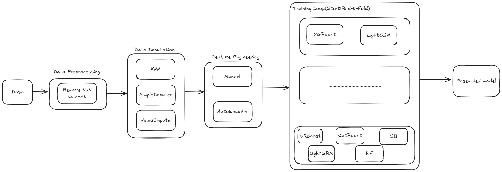
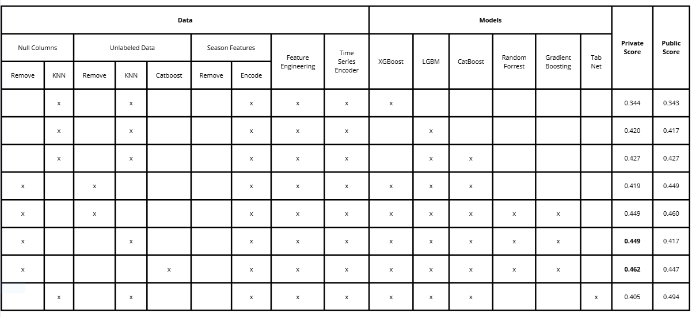

# Child Mind Institute - Problematic Internet Use

## Introduction

The [Child Mind Institute - Problematic Internet Use](https://www.kaggle.com/competitions/child-mind-institute-problematic-internet-use) competition focuses on predicting problematic internet usage (PIU) among children and adolescents based on their physical activity and fitness data. The competition aims to develop predictive models to identify early signs of PIU, enabling timely interventions to promote healthier digital habits.

This dataset is provided by the [Healthy Brain Network](https://healthybrainnetwork.org/) and offers a unique opportunity to explore the relationship between physical activity and digital behavior patterns.

## Data Overview

The dataset includes information collected from nearly 5,000 individuals aged 5–22 years. It consists of two primary components:

1. **Tabular Data**: 
   - Contains physical activity and fitness-related attributes (3,960 records in the training set). 
2. **Time-Series Data**:
   - Features accelerometer data (996 records in the training set).

The test dataset includes **3,800 records**. The competition's objective is to predict problematic internet use scores based on these features.

For further details, refer to the official [data page](https://www.kaggle.com/competitions/child-mind-institute-problematic-internet-use/data).

## Data Analysis
- We start by investigating these public notebooks for some data characteristics:
    - [Tabular EDA](https://www.kaggle.com/code/antoninadolgorukova/cmi-piu-features-eda)
    - [Time Series EDA](https://www.kaggle.com/code/antoninadolgorukova/cmi-piu-actigraphy-data-eda)
    - [Discussion](https://www.kaggle.com/competitions/child-mind-institute-problematic-internet-use/discussion/535354)

## Approaches
We will break down our approach into two different parts including data preprocessing and modeling.

### Data Preprocessing

Given the complexity and sparsity of the dataset, robust preprocessing was critical. Steps included:
1. **Handling Missing Values**:
   - Dropped columns with more than 70% missing values.
   - Used imputation techniques such as:
     - **Simple Imputer**: Replaced missing values using statistical measures such as mean or median.
     - **KNN Imputer**: Imputed missing values by identifying similar data points using k-nearest neighbors.
     - **HyperImpute**: Applied advanced iterative imputation techniques leveraging relationships among features.
2. **Time-Series Feature Extraction**:
   - **AutoEncoders**: Employed to create compact embeddings of the time series data, reducing dimensionality while preserving essential patterns.
3. **Numerical Feature Engineering**:
   - Created derived features from existing columns that have high correlation scores.
   - Used domain knowledge to engineer predictive features.
4. **Data Normalization**:
   - Normalized numerical features to improve model performance.

### Modeling
- With this problem, we could either consider it as a classification problem or a regression problem. However, since the classes are ordinal, meaning that there is a particular order among the labels that we should take into account when defining the loss function. With classification, penalties for wrong prediction is the same for all classes and we would lose valuable information during training. Therefore, we consider this competition to be a regression problem.
- Because of the nature of tabular data, we will lean our solution heavily towards tree-based models as they are more suitable than linear or deep learning models.
- Below are the models(or ensemble of models) that we have tried:
    - XGBoost
    - LightGBM
    - [TabNet](https://github.com/dreamquark-ai/tabnet)
    - LightGBM, CatBoost
    - XGBoost, LightGBM, CatBoost
    - XGBoost, LightGBM, CatBoost, TabNet
    - XGBoost, LightGBM, CatBoost, Random Forest, Gradient Boosting 

## Experimental Results

## Accomplishments

### Final Results

- Achieved a **top 164/3628 ranking** on the leaderboard.
- The final submission utilized:
  - **KNN Imputation**: Averaged missing data points effectively.
  - **Voting Regression**: Combined five tree-based models, where **CatBoost** and **LightGBM** contributed most significantly due to their superior performance, with the highest assigned weights.

Although HyperImpute showcases a superior at 0.462 equal to #30 on the Leaderboard, it was not selected as a candidate for final submission because of potential overfitting and low robustness during the experimental period.

