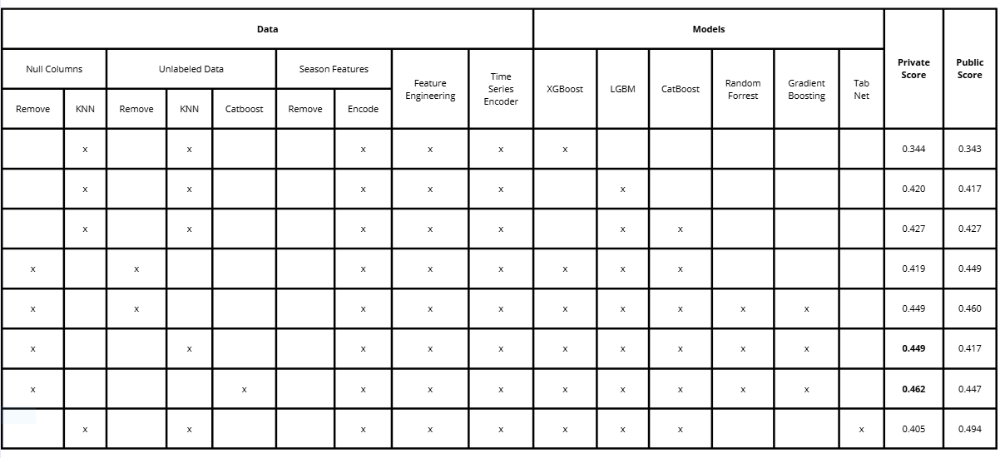

# Child Mind Institute - Problematic Internet Use

## Introduction

This Kaggle [competition](https://www.kaggle.com/competitions/child-mind-institute-problematic-internet-use) is about predicting the level of problematic internet usage exhibited by children and adolescents, based on their physical activity. The goal of this competition is to develop a predictive model that analyzes children's physical activity and fitness data to identify early signs of problematic internet use. Identifying these patterns can help trigger interventions to encourage healthier digital habits. Dataset provided by [Healthy Brain Network](https://healthybrainnetwork.org/).

## Data Overview

- Healthy Brain Network dataset consists of physical activity data and also internet usage behavior data from nearly 5000 people from the range of 5-22 year-olds.
- Training data consists of:
    - The tabular physical activity and fitness data (3960 records).
    - The accelerometer (actigraphy) time series data (996 records).
- Full test data consists of 3800 records.

- For more information, read on this [link](https://www.kaggle.com/competitions/child-mind-institute-problematic-internet-use/data).

## Data Analysis
- We start from investigating these public notebooks for some data characteristics:
    - [Tabular EDA](https://www.kaggle.com/code/antoninadolgorukova/cmi-piu-features-eda)
    - [Time Series EDA](https://www.kaggle.com/code/antoninadolgorukova/cmi-piu-actigraphy-data-eda)
    - [Discussion](https://www.kaggle.com/competitions/child-mind-institute-problematic-internet-use/discussion/535354)

## Approaches
We will breakdown our approach into two different areas including data and models.

### Data

- The dataset has many missing values so we will apply different imputation techniques, things we have tried:
    - Remove columns where 70% of values are NaN
    - Use AutoEncoder to encode time series data
    - Use KNN to impute tabular data
    - Use HyperImpute to impute tabular data
    - Feature Engineering to craft more predictive features

### Models
- With this problem, we could either consider it as a classification problem or a regression problem. However, since the classes are ordinal, meaning that there is a particular order among the labels that we should take into account when defining the loss function. With classification, penalties for wrong prediction is the same for all classes and we would lose valuable information during training. Therefore, we consider this competition to be a regression problem.
- Because of the nature of tabular data, we will lean our solution heavily towards tree-based models as they are more suitable than linear or deep learning models.
- Below are the models(or ensemble of models) that we have tried:
    - XGBoost
    - LightGBM
    - [TabNet](https://github.com/dreamquark-ai/tabnet)
    - LightGBM, CatBoost
    - XGBoost, LightGBM, CatBoost
    - XGBoost, LightGBM, CatBoost, TabNet
    - XGBoost, LightGBM, CatBoost, Random Forest, Gradient Boosting 

## Result

